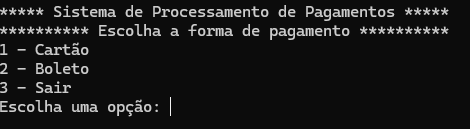
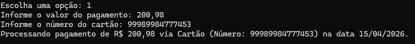
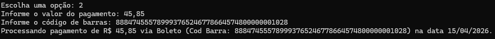

# Sistema de Pagamentos - CP2 C# Software Development

## Integrantes
- Thamiris Almeida Soares da Silva - RM559155  
- Werbeth Kauan Aires Nunes - RM559067  

## Descrição do Projeto

Este projeto é uma aplicação console desenvolvida em C# que simula um sistema de pagamentos.

O sistema permite ao usuário escolher entre pagamento com cartão ou boleto, inserir os dados necessários e visualizar uma mensagem de confirmação com os detalhes da operação.

---

## Funcionamento

Ao iniciar o programa, é exibido um menu com três opções:

1 - Pagamento com Cartão  
2 - Pagamento com Boleto  
3 - Sair  

O usuário escolhe uma opção, informa o valor e os dados solicitados, e o sistema processa o pagamento exibindo uma mensagem com as informações.

---

## Estrutura do Projeto

- Program.cs → controle do fluxo do sistema  
- Menu.cs → exibição do menu principal  
- PagamentoCartao.cs → pagamento com cartão  
- PagamentoBoleto.cs → pagamento com boleto
  

## Testes

Pagamento com Cartão

Pagamento com Boleto

